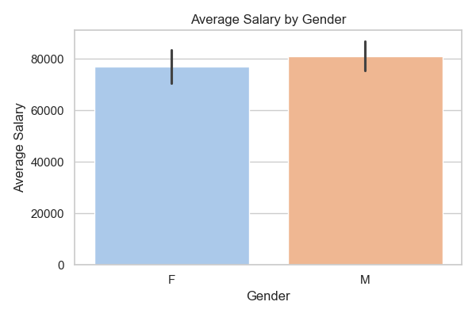
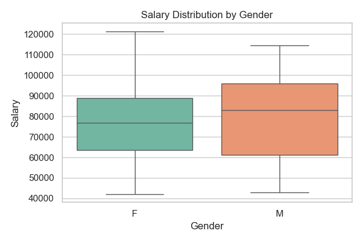
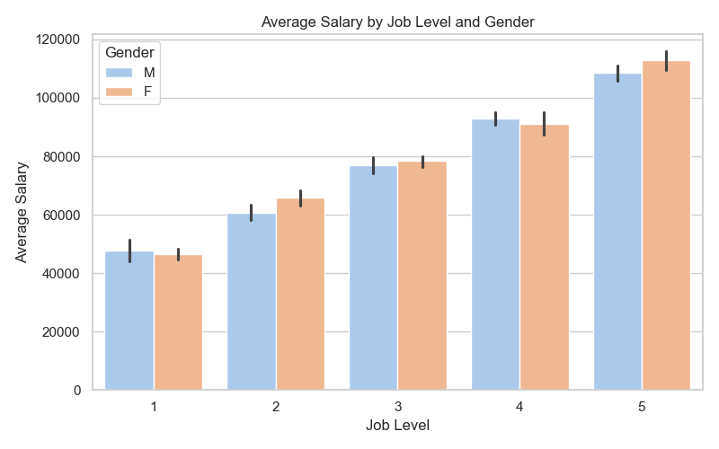

# 🐍 Pay Equity Analysis (Python)

This project explores salary trends and potential gender pay gaps using a mock HR dataset of 100 employees. Built in Python, it analyzes compensation patterns across departments, job levels, and gender using pandas, seaborn, and matplotlib.

---

## 📊 Project Overview

The notebook includes the following visualizations:

- **Average Salary by Gender** – bar chart comparing male vs. female salaries
- **Salary Distribution by Gender** – box plot showing spread, outliers, and medians
- **Average Salary by Job Level and Gender** – side-by-side bar chart by job level

---

## 🛠 Tools Used

- **Python 3.12**
- **Jupyter Notebook**
- **pandas** – data cleaning & grouping
- **matplotlib** – custom visualizations
- **seaborn** – statistical charting

---

## 📁 Files Included

- `HR_Compensation_Data_Python.xlsx` – – full dataset (download to view)
- `HR_Compensation_Data_Python.csv` – previewable version 
- `Pay_Equity_Analysis.ipynb` – full notebook with code and visuals  
- `avg_salary_by_gender.png` – bar chart of average salary by gender  
- `salary_distribution_by_gender.png` – box plot showing salary spread  
- `avg_salary_by_job_level_gender.png` – grouped bar chart by level and gender

 📥 *Note: GitHub does not preview `.xlsx` files — download to view locally.*  

---

## 📸 Visual Samples with Insights

### 📊 Chart: Average Salary by Gender  

### 🔍 Insight:
Male employees have a slightly higher average salary than female employees,   
indicating a potential gender pay gap in the organization.

---

### 📊 Chart: Salary Distribution by Gender  

### 🔍 Insight: 
Salary distributions differ by gender, with male employees showing a wider pay range    
and slightly higher median compensation. No significant outliers were detected.

---

### 📊 Chart: Avg Salary by Job Level & Gender  

### 🔍 Insight: 
At every job level, male employees tend to earn more than female employees on average,   
with the gap becoming more pronounced at higher levels.

---

## 🔍 Summary of Key Insights

- Average salary is higher for males across most levels
- Female salary distribution is more balanced, while male salaries have a wider range
- The gender pay gap becomes more significant at higher job levels

---

📌 *Created by Olga Buriakova*  
💼 [LinkedIn](https://www.linkedin.com/in/olga-buriakova-a13163128/) | 🌐 [Portfolio](https://obu541.github.io/Portfolio/)
